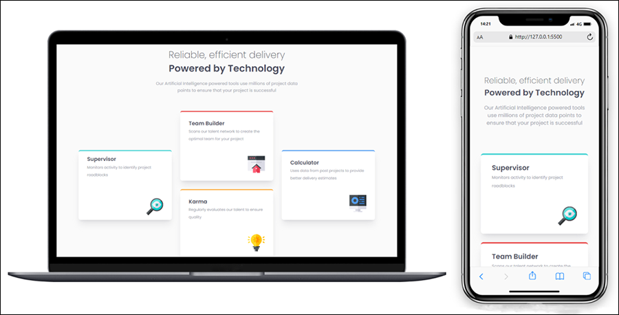

# Frontend Mentor - Product Preview Card Component

This is a solution to the [Four card feature section challenge on Frontend Mentor](https://www.frontendmentor.io/challenges/four-card-feature-section-weK1eFYK). Frontend Mentor challenges help you improve your coding skills by building realistic projects.

## Table of contents

- [**Overview**](#overview)
  - [**Screenshot**](#screenshot)
  - [**Links**](#links)
- [**My process**](#my-process)
  - [**Built with**](#built-with)
- [**Author**](#author)

## Overview

### Screenshot: Desktop | Mobile

### Links

- **Solution URL: https://github.com/fr4nbtt/four-card-feature-section-main**
- **Live Site URL: https://fr4nbtt.github.io/four-card-feature-section-main/**

## My process

### Built with

- **Semantic HTML5 markup**
- **CSS Grid**
- **Tailwind CSS**
- **Flexbox**

## Author

- **Github - [fr4nbtt](https://github.com/fr4nbtt)**
- **Frontend Mentor - [@fr4nbtt](https://www.frontendmentor.io/profile/fr4nbtt)**
